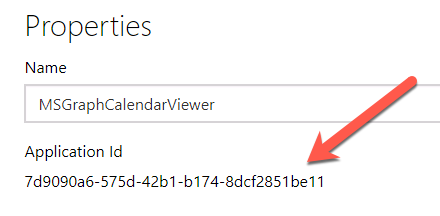
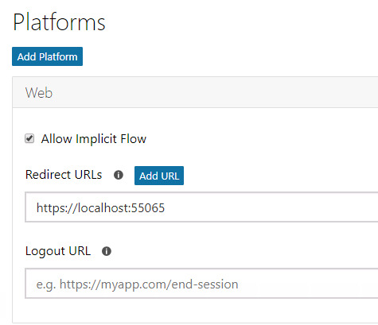
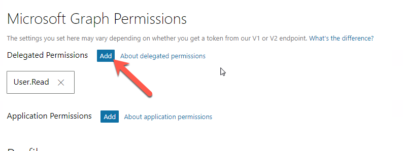
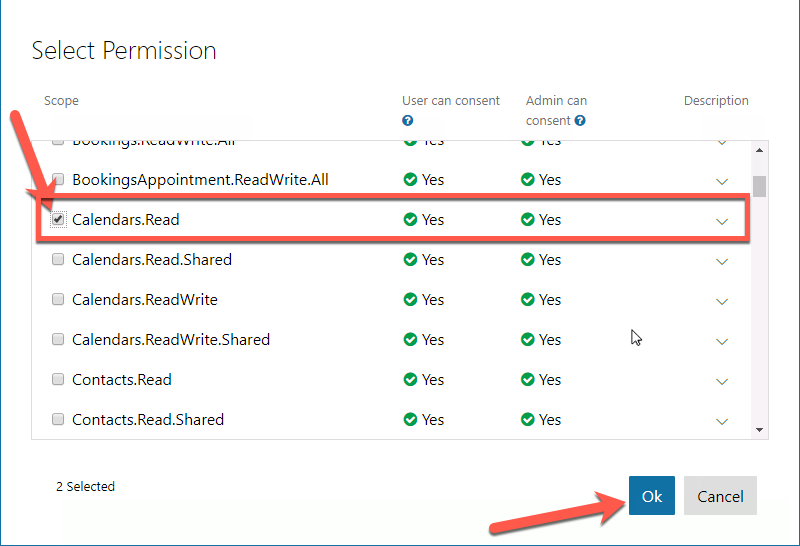
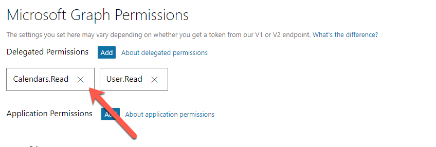

# Register a New Azure AD Application

In this demo you will create a new Azure AD application using the Application Registry Portal (ARP).

1. Open a browser and navigate to the **Application Registry Portal**: **apps.dev.microsoft.com** and login using a **personal account** (aka: Microsoft Account) or **Work or School Account**.
1. Select **Add an app** at the top of the page.
1. On the **Register your application** page, set the **Application Name** to **MSGraphCalendarViewer** and select **Create**.
1. On the **MSGraphCalendarViewer Registration** page, under the **Properties** section, copy the **Application Id** Guid as you will need it later.

    

1. In the **Application Secrets** section, select **Generate New Password**.

    1. Copy the password from the **New password generated** dialog.

        > Note: You must copy this password now as it will never be shown again. You can create additional passwords at a later date, but you must copy them when created for use within an application.

1. In the **Platforms** section, select **Add Platform**.

    1. In the **Add Platform** dialog, select **Web**.
    1. In the **Web** platform box added by the previous dialog's selection, enter the SSL URL from the web application created in the previous exercise for the **Redirect URLs**

        

1. In the **Microsoft Graph Permissions** section, select **Add** next to the **Delegated Permissions** subsection.

    

    In the **Select Permission** dialog, locate and select the permission **Calendars.Read** and select **OK**:

      

      

1. Scroll to the bottom of the page and select **Save**.
1. Go back to the ASP.NET MVC application in Visual Studio and open the **web.config** file.

    Update the `ida:AppId` app setting to the application ID of the application created in this exercise.

    Update the `ida:AppSecret` app setting to the application secret of the application created in this exercise.