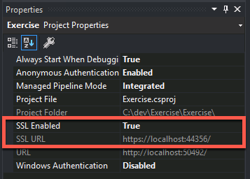
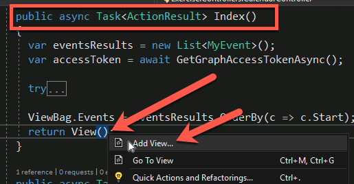
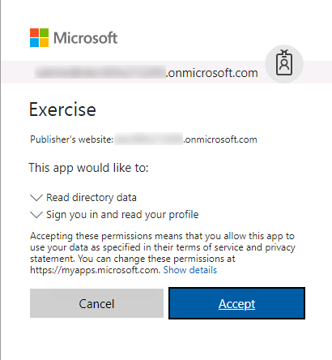
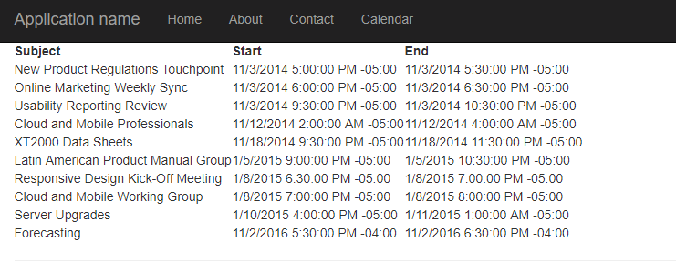

# Build MVC apps with the Microsoft Graph .NET SDK

In this lab you will create an ASP.NET MVC application, configured with Azure Active Directory (Azure AD) for authentication & authorization using the Microsoft Authentication Library (MSAL) & OWIN middleware, that accesses data in Office 365 using the Microsoft Graph .NET SDK.

## In this lab

1. [Create & Configure an ASP.NET MVC Web Application & Configure it for MSAL](#exercise1)
1. [Register a New Azure AD Application](#exercise2)
1. [Update the ASP.NET MVC Application to Leverage the Microsoft Graph .NET SDK](#exercise3)

## Prerequisites

To complete this lab, you need the following:

* Office 365 tenancy
  * If you do not have one, you obtain one (for free) by signing up to the [Office 365 Developer Program](https://developer.microsoft.com/en-us/office/dev-program).
* [Visual Studio 2017](https://www.visualstudio.com/vs)

<a name="exercise1"></a>

## Exercise 1: Create & Configure an ASP.NET MVC Web Application & Configure it for MSAL

In this exercise you will create a new ASP.NET MVC web application. After creating it, you will configure it to use the Microsoft Authentication Library (MSAL) to handle all authentication to acquire a token to call the Microsoft Graph API in a later exercise.

1. Open Visual Studio 2017.
1. In Visual Studio, select **File > New > Project**.
1. In the **New Project** dialog, do the following:
    1. Select **Templates > Visual C# > Web**.
    1. Select **ASP.NET Web Application (.NET Framework)**.
    1. Enter **MSGraphCalendarViewer** for the Name of the project.

        

        > Note: Ensure that you enter the exact same name for the Visual Studio Project that is specified in these lab instructions. The Visual Studio Project name becomes part of the namespace in the code. The code inside these instructions depends on the namespace matching the Visual Studio Project name specified in these instructions. If you use a different project name the code will not compile unless you adjust all the namespaces to match the Visual Studio Project name you enter when you create the project.

    1. Select **OK**.
1. In the **New ASP.NET Web Application Project** dialog, do the following:
    1. Select **MVC**.
    1. Select **OK**.

1. Confirm the web project is using SSL by default:

    1. In the **Solution Explorer** tool window, select the project and look at the **Properties** tool window.
    1. Verify the property **SSL Enabled** is set to **TRUE**.
    1. Copy the **SSL URL** property as you will need it later.
    1. Save your changes.

        

        > It is important to do this now because in the next step when you create the application in Azure AD, you want the reply URL to use HTTPS. If you did not do this now, you would have to manually make the changes the Visual Studio wizard is going to do for you in creating the app.

1. Update the projects application settings:

    1. Open the **web.config** file.
    1. Add the following application settings to the `<appSettings>` XML element. You will update the `ida:AppId` & `ida:AppSecret` properties later. 

        Set the value of `ida:RedierctUri` to the value of the **SSL URL** you copied from a previous step.

          ```xml
          <add key="ida:AppId" value="ENTER_YOUR_APPLICATION_ID" />
          <add key="ida:AppSecret" value="ENTER_YOUR_APPLICATION_SECRET" />
          <add key="ida:RedirectUri" value="ENTER_YOUR_REDIRECT_URL" />
          <add key="ida:GraphScopes" value="User.Read Calendars.Read" />
          ```

1. Add the Microsoft Authentication Library (MSAL) and OWIN middleware packages to the web application:

    1. In Visual Studio, select the menu item **View > Other Windows > Package Manager Console**.
    1. In the **Package Manager Console** tool window, run the following commands to install the necessary packages for MSAL & the OWIN middleware:

        ```powershell
        Install-Package Microsoft.Identity.Client -Pre
        Install-Package Microsoft.IdentityModel.Tokens
        Install-Package Microsoft.Owin
        Install-Package Microsoft.Owin.Host.SystemWeb
        Install-Package Microsoft.Owin.Security.Cookies
        Install-Package Microsoft.Owin.Security.OpenIdConnect
        Install-Package System.IdentityModel.Tokens.Jwt
        ```

1. Add authentication startup and configuration classes for MSAL & OWIN middleware:

    1. Add two partial classes that will be executed when the OWIN middleware starts up when the application loads for the first time. These will configure the application to authenticate with Azure AD using specific application credentials and request permissions:
        1. Copy the [LabFiles/Startup.cs](./LabFiles/Startup.cs) file to the root of the project.
        1. Copy the [LabFiles/Startup.Auth.cs](./LabFiles/Startup.Auth.cs) file to the **App_Start** folder in the project.
    1. Add a sample authentication provider to the project that will be used to obtain an OAuth2 access token from Azure AD:
        1. Create a new folder **Helpers** in the root of the project and add the following files to it:
            * [LabFiles/IAuthProvider.cs](./LabFiles/IAuthProvider.cs)
            * [LabFiles/SampleAuthProvider.cs](./LabFiles/SampleAuthProvider.cs)
    1. Create an OAuth2 token cache to store tokens obtained from Azure AD for a performance optimization. The application will first try to retrieve valid, unexpired tokens from the cache before making the round trip to Azure AD:
        1. Create a new folder **TokenStorage** in the root of the project and add the following files to it:
            * [LabFiles/SessionTokenCache.cs](./LabFiles/SessionTokenCache.cs)

1. Update the user interface of the web application support logging into the application

    1. Add an MVC controller that will handle the login and logout process for the application as well as a partial view that contains the login/logout controls.
        1. Copy the [LabFiles/AccountController.cs](./LabFiles/AccountController.cs) file to the **Controllers** folder in the project.
        1. Copy the [LabFiles/_LoginPartial.cshtml](./LabFiles/_LoginPartial.cshtml) file to the **Views/Shared** folder in the project.
    1. Open the **Views\Shared\_Layout.cshtml** file.
    1. Locate the part of the file that includes a few links at the top of the page. It looks similar to the following markup:

        ```html
        <ul class="nav navbar-nav">
            <li>@Html.ActionLink("Home", "Index", "Home")</li>
            <li>@Html.ActionLink("About", "About", "Home")</li>
            <li>@Html.ActionLink("Contact", "Contact", "Home")</li>
        </ul>
        ```

    1. Add the following immediately after the closing `</ul>` tag

        ```html
        @Html.Partial("_LoginPartial")
        ```

<a name="exercise2"></a>

## Exercise 2: Register a New Azure AD Application

In this exercise you will create a new Azure AD application using the Application Registry Portal (ARP).

1. Open a browser and navigate to the **Application Registry Portal**: **apps.dev.microsoft.com** and login using a **personal account** (aka: Microsoft Account) or **Work or School Account**.
1. Select **Add an app** at the top of the page.
1. On the **Register your application** page, set the **Application Name** to **MSGraphCalendarViewer** and select **Create**.
1. On the **MSGraphCalendarViewer Registration** page, under the **Properties** section, copy the **Application Id** Guid as you will need it later.

    

1. In the **Application Secrets** section, select **Generate New Password**.

    1. Copy the password from the **New password generated** dialog.

        > Note: You must copy this password now as it will never be shown again. You can create additional passwords at a later date, but you must copy them when created for use within an application.

1. In the **Platforms** section, select **Add Platform**.

    1. In the **Add Platform** dialog, select **Web**.
    1. In the **Web** platform box added by the previous dialog's selection, enter the SSL URL from the web application created in the previous exercise for the **Redirect URLs**

        

1. In the **Microsoft Graph Permissions** section, select **Add** next to the **Delegated Permissions** subsection.

    

    In the **Select Permission** dialog, locate and select the permission **Calendars.Read** and select **OK**:

      

      

1. Scroll to the bottom of the page and select **Save**.
1. Go back to the ASP.NET MVC application in Visual Studio and open the **web.config** file.

    Update the `ida:AppId` app setting to the application ID of the application created in this exercise.

    Update the `ida:AppSecret` app setting to the application secret of the application created in this exercise.

<a name="exercise3"></a>

## Exercise 3: Update the ASP.NET MVC Application to Leverage the Microsoft Graph .NET SDK

In this exercise you will add a controller and views that utilize the Microsoft Graph .NET SDK to show the user's calendar.

1. Add the Microsoft Graph .NET SDK via NuGet.

    1. In Visual Studio, select the menu item **View > Other Windows > Package Manager Console**.
    1. In the **Package Manager Console** tool window, run the following command to install the Microsoft Graph .NET SDK:

        ```powershell
        Install-Package Microsoft.Graph
        ```

1. Create a model class to store the event information obtained from the Microsoft Graph API:

    1. In the **Visual Studio** **Solution Explorer** tool window, right-click the **Models** folder and select **Add > Class**.
    1. In the **Add Class** dialog, name the class **MyEvent** and select **Add**.
    1. Add the following `using` statements to the existing ones in the **MyEvents.cs** file that was created.

        ```cs
        using System.ComponentModel;
        using System.ComponentModel.DataAnnotations;
        ```

    1. Add the following code to the `MyEvent` class defining three new members:

        ```cs
        [DisplayName("Subject")]
        public string Subject { get; set; }

        [DisplayName("Start Time")]
        [DisplayFormat(DataFormatString = "{0:MM/dd/yyyy}", ApplyFormatInEditMode = true)]
        public DateTimeOffset? Start { get; set; }

        [DisplayName("End Time")]
        [DisplayFormat(DataFormatString = "{0:MM/dd/yyyy}", ApplyFormatInEditMode = true)]
        public DateTimeOffset? End { get; set; }
        ```

1. Update the authentication provider by adding methods that will return the Microsoft Graph SDK client object:

    1. Open the **Helpers/SampleAuthProvider.cs** file.
    1. Add the following `using` statements to the top of the file:

        ```cs
        using System.Net.Http.Headers;
        using Microsoft.Graph;
        ```

    1. Add the following members to the `SampleAuthProvider` class to return the object and handle signing out:

        ```cs
        private static GraphServiceClient graphClient = null;

        public static GraphServiceClient GetAuthenticatedClient()
        {
          GraphServiceClient graphClient = new GraphServiceClient(
            new DelegateAuthenticationProvider(
              async (requestMessage) =>
              {
                string accessToken = await SampleAuthProvider.Instance.GetUserAccessTokenAsync();
                requestMessage.Headers.Authorization = new AuthenticationHeaderValue("bearer", accessToken);
              }));
          return graphClient;
        }

        public static void SignOutClient()
        {
          graphClient = null;
        }
        ```

1. Update the application to handle Microsoft Graph specific exceptions and signing out of the application:

    1. Open the **Helpers/SampleAuthProvider.cs** file.
    1. Locate the `try-catch` statement at the end of the `GetUserAccessTokenAsync()` method. Replace the following line that throws a generic exception...

        ```cs
        throw new Exception ();
        ```

        With the following code to throw a Microsoft Graph specific exception:

        ```cs
        throw new ServiceException(
          new Error
          {
            Code = GraphErrorCode.AuthenticationFailure.ToString(),
            Message = Resource.Error_AuthChallengeNeeded,
          });
        ```

    1. Open the **Controllers/AccountController.cs** file.
    1. Add the following `using` statements to the top of the file:

        ```cs
        using System.Net.Http.Headers;
        using Microsoft.Graph;
        ```

    1. Locate the `SignoOut()` method. Add the following statement immediately before the `Response.Redirect("/");` line:

      ```cs
      SampleAuthProvider.SignOutClient();
      ```

1. Add a new ASP.NET MVC controller that will retrieve events from the user's calendar:

    1. In the **Visual Studio** **Solution Explorer** tool window, right-click the **Controllers** folder and select **Add > Controller**.
    1. In the **Add Scaffold** dialog, select **MVC 5 Controller - Empty**, select **Add** and name the controller **CalendarController** and then select **Add**.
    1. Add the following `using` statements to the existing ones in the **CalendarController.cs** file that was created.

        ```cs
        using Microsoft.Graph;
        using MSGraphCalendarViewer.Helpers;
        using MSGraphCalendarViewer.Models;
        using System.Net.Http.Headers;
        using System.Security.Claims;
        using System.Threading.Tasks;
        ```

    1. Decorate the controller to allow only authenticated users to use it by adding `[Authorize]` in the line immediately before the controller:

        ```cs
        [Authorize]
        public class CalendarController : Controller
        ```

    1. Modify the existing `Index()` method to be asynchronous by adding the `async` keyword and modifying the return type to be as follows:

        ```cs
        public async Task<ActionResult> Index()
        ```

    1. Update the `Index()` method to use the `GraphServiceClient` object to call the Microsoft Graph API and retrieve the first 20 events in the user's calendar:

        ```cs
        public async Task<ActionResult> Index()
        {
          var eventsResults = new List<MyEvent>();

          try
          {
            var graphService = SampleAuthProvider.GetAuthenticatedClient();
            var request = graphService.Me.Events.Request(new Option[] { new QueryOption("top", "20"), new QueryOption("skip", "0") });
            var userEventsCollectionPage = await request.GetAsync();
            foreach (var evnt in userEventsCollectionPage)
            {
              eventsResults.Add(new MyEvent
              {
                Subject = !string.IsNullOrEmpty(evnt.Subject) ? evnt.Subject : string.Empty,
                Start = !string.IsNullOrEmpty(evnt.Start.DateTime) ? DateTime.Parse(evnt.Start.DateTime) : new DateTime(),
                End = !string.IsNullOrEmpty(evnt.End.DateTime) ? DateTime.Parse(evnt.End.DateTime) : new DateTime()

              });
            }
          }
          catch (Exception el)
          {
            el.ToString();
          }

          ViewBag.Events = eventsResults.OrderBy(c => c.Start);

          return View();
        }
        ```

1. Implement the Calendar controller's associated ASP.NET MVC view:

    1. In the `CalendarController` class method `Index()`, locate the `View()` return statement at the end of the method. Right-click `View()` in the code and select **Add View**:

        

    1. In the **Add View** dialog, set the following values (*leave all other values as their default values*) and select **Add**:

        * **View name:** Index
        * **Template:** Empty (without model)

    1. In the newly created **Views/Calendar/Index.cshtml** file, replace the default code with the following code:

        ```html
        @{
          ViewBag.Title = "Home Page";
        }
        <div>
          <table>
            <thead>
              <tr>
                <th>Subject</th>
                <th>Start</th>
                <th>End</th>
              </tr>
            </thead>
            <tbody>
              @foreach (var o365Event in ViewBag.Events)
              {
                <tr>
                  <td>@o365Event.Subject</td>
                  <td>@o365Event.Start</td>
                  <td>@o365Event.End</td>
                </tr>
              }
            </tbody>
          </table>
        </div>
        ```

    1. Update the navigation in the **Views/Shared/_Layout.cshtml** file to include a fourth link pointing to a new controller *Calendar*:

        ```html
        <ul class="nav navbar-nav">
          <li>@Html.ActionLink("Home", "Index", "Home")</li>
          <li>@Html.ActionLink("About", "About", "Home")</li>
          <li>@Html.ActionLink("Contact", "Contact", "Home")</li>
          <li>@Html.ActionLink("Calendar", "Index", "Calendar")</li>
        </ul>
        ```

1. Save your changes to all files.

Test the application:

1. Press **F5** to start the application.
1. When the browser loads, select **Signin with Microsoft** and login.
1. If this is the first time running the application, you will be prompted to consent to the application. Review the consent dialog and select **Accept**. The dialog will look similar to the following dialog:

    

1. When the ASP.NET application loads, select the **Calendar** link in the top navigation.
1. You should see a list of calendar items from your calendar appear on the page.

    
