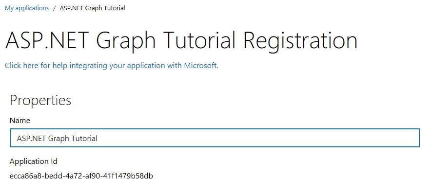
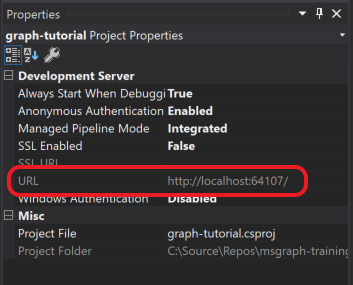

# Build ASP.NET MVC apps with Microsoft Graph

In this lab you will create an ASP.NET MVC application, configured with Azure Active Directory (Azure AD) for authentication & authorization using the Microsoft Authentication Library (MSAL) & OWIN middleware, that accesses data in Office 365 using the Microsoft Graph .NET SDK.

## In this lab

- [Exercise 1: Create an ASP.NET MVC Web Application](#exercise-1-create-an-aspnet-mvc-web-application)
- [Exercise 2: Register a web application with the Application Registration Portal](#exercise-2-register-a-web-application-with-the-application-registration-portal)
- [Exercise 3: Extend the app for Azure AD Authentication](#exercise-3-extend-the-app-for-azure-ad-authentication)
- [Exercise 4: Extend the app for Microsoft Graph](#exercise-4-extend-the-app-for-microsoft-graph)

## Prerequisites

To complete this lab, you need the following:

- [Visual Studio](https://visualstudio.microsoft.com/vs/) installed on your development machine. If you do not have Visual Studio, visit the previous link for download options. (**Note:** This tutorial was written with Visual Studio 2017 version 15.81. The steps in this guide may work with other versions, but that has not been tested.)
- Either a personal Microsoft account with a mailbox on Outlook.com, or a Microsoft work or school account.

If you don't have a Microsoft account, there are a couple of options to get a free account:

- You can [sign up for a new personal Microsoft account](https://signup.live.com/signup?wa=wsignin1.0&rpsnv=12&ct=1454618383&rver=6.4.6456.0&wp=MBI_SSL_SHARED&wreply=https://mail.live.com/default.aspx&id=64855&cbcxt=mai&bk=1454618383&uiflavor=web&uaid=b213a65b4fdc484382b6622b3ecaa547&mkt=E-US&lc=1033&lic=1).
- You can [sign up for the Office 365 Developer Program](https://developer.microsoft.com/office/dev-program) to get a free Office 365 subscription.

## Exercise 1: Create an ASP.NET MVC Web Application

Open Visual Studio, and select **File > New > Project**. In the **New Project** dialog, do the following:

1. Select **Templates > Visual C# > Web**.
1. Select **ASP.NET Web Application (.NET Framework)**.
1. Enter **graph-tutorial** for the Name of the project.


> Note: Ensure that you enter the exact same name for the Visual Studio Project that is specified in these lab instructions. The Visual Studio Project name becomes part of the namespace in the code. The code inside these instructions depends on the namespace matching the Visual Studio Project name specified in these instructions. If you use a different project name the code will not compile unless you adjust all the namespaces to match the Visual Studio Project name you enter when you create the project.

Select **OK**. In the **New ASP.NET Web Application Project** dialog, select **MVC** (under **ASP.NET 4.7.0 Templates**) and select **OK**.

Press **F5** or select **Debug > Start Debugging**. If everything is working, your default browser should open and display a default ASP.NET page.

Before moving on, update the `bootstrap` NuGet package, and install some additional NuGet packages that you will use later.

- [Microsoft.Owin.Host.SystemWeb](https://www.nuget.org/packages/Microsoft.Owin.Host.SystemWeb/) to enable the [OWIN](http://owin.org/) interfaces in the ASP.NET application.
- [Microsoft.Owin.Security.OpenIdConnect](https://www.nuget.org/packages/Microsoft.Owin.Security.OpenIdConnect/) for doing OpenID Connect authentication with Azure.
- [Microsoft.Owin.Security.Cookies](https://www.nuget.org/packages/Microsoft.Owin.Security.Cookies/) to enable cookie-based authentication.
- [Microsoft.Identity.Client](https://www.nuget.org/packages/Microsoft.Identity.Client/) for requesting and managing access tokens.
- [Microsoft.Graph](https://www.nuget.org/packages/Microsoft.Graph/) for making calls to the Microsoft Graph.

Select **Tools > NuGet Package Manager > Package Manager Console**. In the Package Manager Console, enter the following commands.

```Powershell
Update-Package bootstrap
Install-Package Microsoft.Owin.Host.SystemWeb
Install-Package Microsoft.Owin.Security.OpenIdConnect
Install-Package Microsoft.Owin.Security.Cookies
Install-Package Microsoft.Identity.Client -Pre
Install-Package Microsoft.Graph
```

Create a basic OWIN startup class. Right-click the `graph-tutorial` folder in Solution Explorer and choose **Add > New Item**. Choose the **OWIN Startup Class** template, name the file `Startup.cs`, and choose **Add**.

### Design the app

Start by creating a simple model for an error message. You'll use this model to flash error messages in the app's views.

Right-click the **Models** folder in Solution Explorer and choose **Add > Class...**. Name the class `Alert` and choose **Add**. Add the following code in `Alert.cs`.

```cs
namespace graph_tutorial.Models
{
    public class Alert
    {
        public const string AlertKey = "TempDataAlerts";
        public string Message { get; set; }
        public string Debug { get; set; }
    }
}
```

Now update the global layout of the app. Open the `./Views/Shared/_Layout.cshtml` file, and replace its entire contents with the following code.

```html
@{
    var alerts = TempData.ContainsKey(graph_tutorial.Models.Alert.AlertKey) ?
        (List<graph_tutorial.Models.Alert>)TempData[graph_tutorial.Models.Alert.AlertKey] :
        new List<graph_tutorial.Models.Alert>();
}

<!DOCTYPE html>
<html>
<head>
    <meta charset="utf-8" />
    <meta name="viewport" content="width=device-width, initial-scale=1.0">
    <title>ASP.NET Graph Tutorial</title>
    @Styles.Render("~/Content/css")
    @Scripts.Render("~/bundles/modernizr")

    <link rel="stylesheet" href="https://use.fontawesome.com/releases/v5.1.0/css/all.css" integrity="sha384-lKuwvrZot6UHsBSfcMvOkWwlCMgc0TaWr+30HWe3a4ltaBwTZhyTEggF5tJv8tbt" crossorigin="anonymous">
</head>

<body>
    <nav class="navbar navbar-expand-md navbar-dark fixed-top bg-dark">
        <div class="container">
            @Html.ActionLink("ASP.NET Graph Tutorial", "Index", "Home", new { area = "" }, new { @class = "navbar-brand" })
            <button class="navbar-toggler" type="button" data-toggle="collapse" data-target="#navbarCollapse" aria-controls="navbarCollapse" aria-expanded="false" aria-label="Toggle navigation">
                <span class="navbar-toggler-icon"></span>
            </button>
            <div class="collapse navbar-collapse" id="navbarCollapse">
                <ul class="navbar-nav mr-auto">
                    <li class="nav-item">
                        @Html.ActionLink("Home", "Index", "Home", new { area = "" }, new { @class = ViewBag.Current == "Home" ? "nav-link active" : "nav-link" })
                    </li>
                    @if (Request.IsAuthenticated)
                    {
                        <li class="nav-item" data-turbolinks="false">
                            @Html.ActionLink("Calendar", "Index", "Calendar", new { area = "" }, new { @class = ViewBag.Current == "Calendar" ? "nav-link active" : "nav-link" })
                        </li>
                    }
                </ul>
                <ul class="navbar-nav justify-content-end">
                    <li class="nav-item">
                        <a class="nav-link" href="https://developer.microsoft.com/graph/docs/concepts/overview" target="_blank"><i class="fas fa-external-link-alt mr-1"></i>Docs</a>
                    </li>
                    @if (Request.IsAuthenticated)
                    {
                        <li class="nav-item dropdown">
                            <a class="nav-link dropdown-toggle" data-toggle="dropdown" href="#" role="button" aria-haspopup="true" aria-expanded="false">
                                @if (!string.IsNullOrEmpty(ViewBag.User.Avatar))
                                {
                                    
                                }
                                else
                                {
                                    <i class="far fa-user-circle fa-lg rounded-circle align-self-center mr-2" style="width: 32px;"></i>
                                }
                            </a>
                            <div class="dropdown-menu dropdown-menu-right">
                                <h5 class="dropdown-item-text mb-0">@ViewBag.User.DisplayName</h5>
                                <p class="dropdown-item-text text-muted mb-0">@ViewBag.User.Email</p>
                                <div class="dropdown-divider"></div>
                                @Html.ActionLink("Sign Out", "SignOut", "Account", new { area = "" }, new { @class = "dropdown-item" })
                            </div>
                        </li>
                    }
                    else
                    {
                        <li class="nav-item">
                            @Html.ActionLink("Sign In", "SignIn", "Account", new { area = "" }, new { @class = "nav-link" })
                        </li>
                    }
                </ul>
            </div>
        </div>
    </nav>
    <main role="main" class="container">
        @foreach (var alert in alerts)
        {
            <div class="alert alert-danger" role="alert">
                <p class="mb-3">@alert.Message</p>
                @if (!string.IsNullOrEmpty(alert.Debug))
                {
                    <pre class="alert-pre border bg-light p-2"><code>@alert.Debug</code></pre>
                }
            </div>
        }

        @RenderBody()
    </main>
    @Scripts.Render("~/bundles/jquery")
    @Scripts.Render("~/bundles/bootstrap")
    @RenderSection("scripts", required: false)
</body>
</html>
```

This code adds [Bootstrap](http://getbootstrap.com/) for simple styling, and [Font Awesome](https://fontawesome.com/) for some simple icons. It also defines a global layout with a nav bar, and uses the `Alert` class to display any alerts.

Now open `Content/Site.css` and replace its entire contents with the following code.

```css
body {
  padding-top: 4.5rem;
}

.alert-pre {
  word-wrap: break-word;
  word-break: break-all;
  white-space: pre-wrap;
}
```

Now update the default page. Open the `Views/Home/index.cshtml` file and replace its contents with the following.

```html
@{
    ViewBag.Current = "Home";
}

<div class="jumbotron">
    <h1>ASP.NET Graph Tutorial</h1>
    <p class="lead">This sample app shows how to use the Microsoft Graph API to access Outlook and OneDrive data from ASP.NET</p>
    @if (Request.IsAuthenticated)
    {
        <h4>Welcome @ViewBag.User.DisplayName!</h4>
        <p>Use the navigation bar at the top of the page to get started.</p>
    }
    else
    {
        @Html.ActionLink("Click here to sign in", "SignIn", "Account", new { area = "" }, new { @class = "btn btn-primary btn-large" })
    }
</div>
```

Now add a helper function to create an `Alert` and pass it to the view. In order to make it easily available to any controller we create, define a base controller class.

Right-click the **Controllers** folder in Solution Explorer and choose **Add > Controller...**. Choose **MVC 5 Controller - Empty** and choose **Add**. Name the controller `BaseController` and choose **Add**. Replace the contents of `BaseController.cs` with the following code.

```cs
using graph_tutorial.Models;
using System.Collections.Generic;
using System.Web.Mvc;

namespace graph_tutorial.Controllers
{
    public abstract class BaseController : Controller
    {
        protected void Flash(string message, string debug=null)
        {
            var alerts = TempData.ContainsKey(Alert.AlertKey) ?
                (List<Alert>)TempData[Alert.AlertKey] :
                new List<Alert>();

            alerts.Add(new Alert
            {
                Message = message,
                Debug = debug
            });

            TempData[Alert.AlertKey] = alerts;
        }
    }
}
```

Any controller can inherit from this base controller class to gain access to the `Flash` function. Update the `HomeController` class to inherit from `BaseController`. Open `Controllers/HomeController.cs` and change the `public class HomeController : Controller` line to:

```cs
public class HomeController : BaseController
```

Save all of your changes and restart the server. Now, the app should look very different.


## Exercise 2: Register a web application with the Application Registration Portal

In this exercise, you will create a new Azure AD web application registration using the Application Registry Portal (ARP).

1. Open a browser and navigate to the [Application Registration Portal](https://apps.dev.microsoft.com). Login using a **personal account** (aka: Microsoft Account) or **Work or School Account**.

1. Select **Add an app** at the top of the page.

    > **Note:** If you see more than one **Add an app** button on the page, select the one that corresponds to the **Converged apps** list.

1. On the **Register your application** page, set the **Application Name** to **ASP.NET Graph Tutorial** and select **Create**.

    

1. On the **ASP.NET Graph Tutorial Registration** page, under the **Properties** section, copy the **Application Id** as you will need it later.

    

1. Scroll down to the **Application Secrets** section.

    1. Select **Generate New Password**.
    1. In the **New password generated** dialog, copy the contents of the box as you will need it later.

        > **Important:** This password is never shown again, so make sure you copy it now.

    

1. Determine your ASP.NET app's URL. In Visual Studio's Solution Explorer, select the **graph-tutorial** project. In the **Properties** window, find the value of **URL**. Copy this value.

    

1. Scroll down to the **Platforms** section.

    1. Select **Add Platform**.
    1. In the **Add Platform** dialog, select **Web**.

        

    1. In the **Web** platform box, enter the URL you copied from the Visual Studio project's properties for the **Redirect URLs**.

        

1. Scroll to the bottom of the page and select **Save**.

## Exercise 3: Extend the app for Azure AD Authentication

In this exercise you will extend the application from the previous exercise to support authentication with Azure AD. This is required to obtain the necessary OAuth access token to call the Microsoft Graph. In this step you will integrate the OWIN middleware and the [Microsoft Authentication Library](https://www.nuget.org/packages/Microsoft.Identity.Client/) library into the application.

Right-click the **graph-tutorial** project in Solution Explorer and choose **Add > New Item...**. Choose **Web Configuration File**, name the file `PrivateSettings.config` and choose **Add**. Replace its entire contents with the following code.

```xml
<appSettings>
    <add key="ida:AppID" value="YOUR APP ID" />
    <add key="ida:AppSecret" value="YOUR APP PASSWORD" />
    <add key="ida:RedirectUri" value="http://localhost:PORT/" />
    <add key="ida:AppScopes" value="email User.Read Calendars.Read" />
</appSettings>
```

Replace `YOUR APP ID HERE` with the application ID from the Application Registration Portal, and replace `YOUR APP SECRET HERE` with the password you generated. Also be sure to modify the `PORT` value for the `ida:RedirectUri` to match your application's URL.

> **Important:** If you're using source control such as git, now would be a good time to exclude the `PrivateSettings.config` file from source control to avoid inadvertently leaking your app ID and password.

Update `Web.config` to load this new file. Replace the `<appSettings>` (line 7) with the following

```xml
<appSettings file="PrivateSettings.config">
```

### Implement sign-in

Start by initializing the OWIN middleware to use Azure AD authentication for the app. Right-click the **App_Start** folder in Solution Explorer and choose **Add > Class...**. Name the file `Startup.Auth.cs` and choose **Add**. Replace the entire contents with the following code.

```cs
using Microsoft.Identity.Client;
using Microsoft.IdentityModel.Protocols.OpenIdConnect;
using Microsoft.IdentityModel.Tokens;
using Microsoft.Owin.Security;
using Microsoft.Owin.Security.Cookies;
using Microsoft.Owin.Security.Notifications;
using Microsoft.Owin.Security.OpenIdConnect;
using Owin;
using System.Configuration;
using System.Threading.Tasks;

namespace graph_tutorial
{
    public partial class Startup
    {
        // Load configuration settings from PrivateSettings.config
        private static string appId = ConfigurationManager.AppSettings["ida:AppId"];
        private static string appSecret = ConfigurationManager.AppSettings["ida:AppSecret"];
        private static string redirectUri = ConfigurationManager.AppSettings["ida:RedirectUri"];
        private static string graphScopes = ConfigurationManager.AppSettings["ida:AppScopes"];

        public void ConfigureAuth(IAppBuilder app)
        {
            app.SetDefaultSignInAsAuthenticationType(CookieAuthenticationDefaults.AuthenticationType);

            app.UseCookieAuthentication(new CookieAuthenticationOptions());

            app.UseOpenIdConnectAuthentication(
              new OpenIdConnectAuthenticationOptions
              {
                  ClientId = appId,
                  Authority = "https://login.microsoftonline.com/common/v2.0",
                  Scope = $"openid email profile offline_access {graphScopes}",
                  RedirectUri = redirectUri,
                  PostLogoutRedirectUri = redirectUri,
                  TokenValidationParameters = new TokenValidationParameters
                  {
                      // For demo purposes only, see below
                      ValidateIssuer = false

                      // In a real multi-tenant app, you would add logic to determine whether the
                      // issuer was from an authorized tenant
                      //ValidateIssuer = true,
                      //IssuerValidator = (issuer, token, tvp) =>
                      //{
                      //  if (MyCustomTenantValidation(issuer))
                      //  {
                      //    return issuer;
                      //  }
                      //  else
                      //  {
                      //    throw new SecurityTokenInvalidIssuerException("Invalid issuer");
                      //  }
                      //}
                  },
                  Notifications = new OpenIdConnectAuthenticationNotifications
                  {
                      AuthenticationFailed = OnAuthenticationFailedAsync,
                      AuthorizationCodeReceived = OnAuthorizationCodeReceivedAsync
                  }
              }
            );
        }

        private static Task OnAuthenticationFailedAsync(AuthenticationFailedNotification<OpenIdConnectMessage,
          OpenIdConnectAuthenticationOptions> notification)
        {
            notification.HandleResponse();
            string redirect = $"/Home/Error?message={notification.Exception.Message}";
            if (notification.ProtocolMessage != null && !string.IsNullOrEmpty(notification.ProtocolMessage.ErrorDescription))
            {
                redirect += $"&debug={notification.ProtocolMessage.ErrorDescription}";
            }
            notification.Response.Redirect(redirect);
            return Task.FromResult(0);
        }

        private async Task OnAuthorizationCodeReceivedAsync(AuthorizationCodeReceivedNotification notification)
        {
            var idClient = new ConfidentialClientApplication(
                appId, redirectUri, new ClientCredential(appSecret), null, null);

            string message;
            string debug;

            try
            {
                string[] scopes = graphScopes.Split(' ');

                var result = await idClient.AcquireTokenByAuthorizationCodeAsync(
                    notification.Code, scopes);

                message = "Access token retrieved.";
                debug = result.AccessToken;
            }
            catch (MsalException ex)
            {
                message = "AcquireTokenByAuthorizationCodeAsync threw an exception";
                debug = ex.Message;
            }

            notification.HandleResponse();
            notification.Response.Redirect($"/Home/Error?message={message}&debug={debug}");
        }
    }
}
```

This code configures the OWIN middleware with the values from `PrivateSettings.config` and defines two callback methods, `OnAuthenticationFailedAsync` and `OnAuthorizationCodeReceivedAsync`. These callback methods will be invoked when the sign-in process returns from Azure.

Now update the `Startup.cs` file to call the `ConfigureAuth` method. Replace the entire contents of `Startup.cs` with the following code.

```cs
using Microsoft.Owin;
using Owin;

[assembly: OwinStartup(typeof(graph_tutorial.Startup))]

namespace graph_tutorial
{
    public partial class Startup
    {
        public void Configuration(IAppBuilder app)
        {
            ConfigureAuth(app);
        }
    }
}
```

Add an `Error` action to the `HomeController` class to transform the `message` and `debug` query parameters into an `Alert` object. Open `Controllers/HomeController.cs` and add the following function.

```cs
public ActionResult Error(string message, string debug)
{
    Flash(message, debug);
    return RedirectToAction("Index");
}
```

Add a controller to handle sign-in. Right-click the **Controllers** folder in Solution Explorer and choose **Add > Controller...**. Choose **MVC 5 Controller - Empty** and choose **Add**. Name the controller `AccountController` and choose **Add**. Replace the entire contents of the file with the following code.

```cs
using Microsoft.Owin.Security;
using Microsoft.Owin.Security.OpenIdConnect;
using System.Web;
using System.Web.Mvc;

namespace graph_tutorial.Controllers
{
    public class AccountController : Controller
    {
        public void SignIn()
        {
            if (!Request.IsAuthenticated)
            {
                // Signal OWIN to send an authorization request to Azure
                Request.GetOwinContext().Authentication.Challenge(
                    new AuthenticationProperties { RedirectUri = "/" },
                    OpenIdConnectAuthenticationDefaults.AuthenticationType);
            }
        }
    }
}
```

This defines a single action, `SignIn`. This action checks if the request is already authenticated. If not, it invokes the OWIN middleware to authenticate the user.

Save your changes and start the project. Click the sign-in button and you should be redirected to `https://login.microsoftonline.com`. Login with your Microsoft account and consent to the requested permissions. The browser redirects to the app, showing the token.

#### Get user details

Start by creating a new file to hold all of your Microsoft Graph calls. Right-click the **graph-tutorial** folder in Solution Explorer, and choose **Add > New Folder**. Name the folder `Helpers`. Right click this new folder and choose **Add > Class...**. Name the file `GraphHelper.cs` and choose **Add**. Replace the contents of this file with the following code.

```cs
using Microsoft.Graph;
using System.Net.Http.Headers;
using System.Threading.Tasks;

namespace graph_tutorial.Helpers
{
    public static class GraphHelper
    {
        public static async Task<User> GetUserDetailsAsync(string accessToken)
        {
            var graphClient = new GraphServiceClient(
                new DelegateAuthenticationProvider(
                    async (requestMessage) =>
                    {
                        requestMessage.Headers.Authorization =
                            new AuthenticationHeaderValue("Bearer", accessToken);
                    }));

            return await graphClient.Me.Request().GetAsync();
        }
    }
}
```

This implements the `GetUserDetails` function, which uses the Microsoft Graph SDK to call the `/me` endpoint and return the result.

Update the `OnAuthorizationCodeReceivedAsync` method in `App_Start/Startup.Auth.cs` to call this function. First, add the following `using` statement to the top of the file.

```cs
using graph_tutorial.Helpers;
```

Replace the existing `try` block in `OnAuthorizationCodeReceivedAsync` with the following code.

```cs
try
{
    string[] scopes = graphScopes.Split(' ');

    var result = await idClient.AcquireTokenByAuthorizationCodeAsync(
        notification.Code, scopes);

    var userDetails = await GraphHelper.GetUserDetailsAsync(result.AccessToken);

    string email = string.IsNullOrEmpty(userDetails.Mail) ?
        userDetails.UserPrincipalName : userDetails.Mail;

    message = "User info retrieved.";
    debug = $"User: {userDetails.DisplayName}, Email: {email}";
}
```

Now if you save your changes and start the app, after sign-in you should see the user's name and email address instead of the access token.

### Storing the tokens

Now that you can get tokens, it's time to implement a way to store them in the app. Since this is a sample app, we'll use the session to store the tokens. A real-world app would use a more reliable secure storage solution, like a database.

Right-click the **graph-tutorial** folder in Solution Explorer, and choose **Add > New Folder**. Name the folder `TokenStorage`. Right click this new folder and choose **Add > Class...**. Name the file `SessionTokenStore.cs` and choose **Add**. Replace the contents of this file with the following code.

```cs
using Microsoft.Identity.Client;
using Newtonsoft.Json;
using System.Threading;
using System.Web;

namespace graph_tutorial.TokenStorage
{
    // Simple class to serialize into the session
    public class CachedUser
    {
        public string DisplayName { get; set; }
        public string Email { get; set; }
        public string Avatar { get; set; }
    }

    // Adapted from https://github.com/Azure-Samples/active-directory-dotnet-webapp-openidconnect-v2
    public class SessionTokenStore
    {
        private static ReaderWriterLockSlim sessionLock = new ReaderWriterLockSlim(LockRecursionPolicy.NoRecursion);
        private readonly string userId = string.Empty;
        private readonly string cacheId = string.Empty;
        private readonly string cachedUserId = string.Empty;
        private HttpContextBase httpContext = null;

        TokenCache tokenCache = new TokenCache();

        public SessionTokenStore(string userId, HttpContextBase httpContext)
        {
            this.userId = userId;
            cacheId = $"{userId}_TokenCache";
            cachedUserId = $"{userId}_UserCache";
            this.httpContext = httpContext;
            Load();
        }

        public TokenCache GetMsalCacheInstance()
        {
            tokenCache.SetBeforeAccess(BeforeAccessNotification);
            tokenCache.SetAfterAccess(AfterAccessNotification);
            Load();
            return tokenCache;
        }

        public bool HasData()
        {
            return (httpContext.Session[cacheId] != null && ((byte[])httpContext.Session[cacheId]).Length > 0);
        }

        public void Clear()
        {
            httpContext.Session.Remove(cacheId);
        }

        private void Load()
        {
            sessionLock.EnterReadLock();
            tokenCache.Deserialize((byte[])httpContext.Session[cacheId]);
            sessionLock.ExitReadLock();
        }

        private void Persist()
        {
            sessionLock.EnterReadLock();

            // Optimistically set HasStateChanged to false.
            // We need to do it early to avoid losing changes made by a concurrent thread.
            tokenCache.HasStateChanged = false;

            httpContext.Session[cacheId] = tokenCache.Serialize();
            sessionLock.ExitReadLock();
        }

        // Triggered right before MSAL needs to access the cache.
        private void BeforeAccessNotification(TokenCacheNotificationArgs args)
        {
            // Reload the cache from the persistent store in case it changed since the last access.
            Load();
        }

        // Triggered right after MSAL accessed the cache.
        private void AfterAccessNotification(TokenCacheNotificationArgs args)
        {
            // if the access operation resulted in a cache update
            if (tokenCache.HasStateChanged)
            {
                Persist();
            }
        }

        public void SaveUserDetails(CachedUser user)
        {
            sessionLock.EnterReadLock();
            httpContext.Session[cachedUserId] = JsonConvert.SerializeObject(user);
            sessionLock.ExitReadLock();
        }

        public CachedUser GetUserDetails()
        {
            sessionLock.EnterReadLock();
            var cachedUser = JsonConvert.DeserializeObject<CachedUser>((string)httpContext.Session[cachedUserId]);
            sessionLock.ExitReadLock();
            return cachedUser;
        }
    }
}
```

This code creates a `SessionTokenStore` class that works with the MSAL library's `TokenCache` class. Most of the code here involves serializing and deserializing the `TokenCache` to the session. It also provides a class and methods to serialize and deserialize the user's details to the session.

Now, add the following `using` statement to the top of the `App_Start/Startup.Auth.cs` file.

```cs
using graph_tutorial.TokenStorage;
using System.IdentityModel.Claims;
```

Now update the `OnAuthorizationCodeReceivedAsync` function to create an instance of the `SessionTokenStore` class and provide that to the constructor for the `ConfidentialClientApplication` object. That will cause MSAL to use your cache implementation for storing tokens. Replace the existing `OnAuthorizationCodeReceivedAsync` function with the following.

```js
private async Task OnAuthorizationCodeReceivedAsync(AuthorizationCodeReceivedNotification notification)
{
    // Get the signed in user's id and create a token cache
    string signedInUserId = notification.AuthenticationTicket.Identity.FindFirst(ClaimTypes.NameIdentifier).Value;
    SessionTokenStore tokenStore = new SessionTokenStore(signedInUserId,
        notification.OwinContext.Environment["System.Web.HttpContextBase"] as HttpContextBase);

    var idClient = new ConfidentialClientApplication(
        appId, redirectUri, new ClientCredential(appSecret), tokenStore.GetMsalCacheInstance(), null);

    try
    {
        string[] scopes = graphScopes.Split(' ');

        var result = await idClient.AcquireTokenByAuthorizationCodeAsync(
            notification.Code, scopes);

        var userDetails = await GraphHelper.GetUserDetailsAsync(result.AccessToken);

        var cachedUser = new CachedUser()
        {
            DisplayName = userDetails.DisplayName,
            Email = string.IsNullOrEmpty(userDetails.Mail) ?
            userDetails.UserPrincipalName : userDetails.Mail,
            Avatar = string.Empty
        };

        tokenStore.SaveUserDetails(cachedUser);
    }
    catch (MsalException ex)
    {
        string message = "AcquireTokenByAuthorizationCodeAsync threw an exception";
        notification.HandleResponse();
        notification.Response.Redirect($"/Home/Error?message={message}&debug={ex.Message}");
    }
    catch(Microsoft.Graph.ServiceException ex)
    {
        string message = "GetUserDetailsAsync threw an exception";
        notification.HandleResponse();
        notification.Response.Redirect($"/Home/Error?message={message}&debug={ex.Message}");
    }
}
```

To summarize the changes:

- The code now passes a `TokenCache` object to the constructor for `ConfidentialClientApplication`. The MSAL library will handle the logic of storing the tokens and refreshing it when needed.
- The code now passes the user details obtained from Microsoft Graph to the `SessionTokenStore` object to store in the session.
- On success, the code no longer redirects, it just returns. This allows the OWIN middleware to complete the authentication process.

The cached user details are something that every view in the application will need, so update the `BaseController` class to load this information from the session. Open `Controllers/BaseController.cs` and add the following `using` statements to the top of the file.

```cs
using graph_tutorial.TokenStorage;
using System.Security.Claims;
using System.Web;
using Microsoft.Owin.Security.Cookies;
```

Then add the following function.

```cs
protected override void OnActionExecuting(ActionExecutingContext filterContext)
{
    if (Request.IsAuthenticated)
    {
        // Get the signed in user's id and create a token cache
        string signedInUserId = ClaimsPrincipal.Current.FindFirst(ClaimTypes.NameIdentifier).Value;
        SessionTokenStore tokenStore = new SessionTokenStore(signedInUserId, HttpContext);

        if (tokenStore.HasData())
        {
            // Add the user to the view bag
            ViewBag.User = tokenStore.GetUserDetails();
        }
        else
        {
            // The session has lost data. This happens often
            // when debugging. Log out so the user can log back in
            Request.GetOwinContext().Authentication.SignOut(CookieAuthenticationDefaults.AuthenticationType);
            filterContext.Result = RedirectToAction("Index", "Home");
        }
    }

    base.OnActionExecuting(filterContext);
}
```

Start the server and go through the sign-in process. You should end up back on the home page, but the UI should change to indicate that you are signed-in.


Click the user avatar in the top right corner to access the **Sign Out** link. Clicking **Sign Out** resets the session and returns you to the home page.

>Note: If you have difficulty with making the labs work it is more than likely that you're having issues with the user cache. Please try clearing your browser cache and/or creating a private or guest session.


### Refreshing tokens

At this point your application has an access token, which is sent in the `Authorization` header of API calls. This is the token that allows the app to access the Microsoft Graph on the user's behalf.

However, this token is short-lived. The token expires an hour after it is issued. This is where the refresh token becomes useful. The refresh token allows the app to request a new access token without requiring the user to sign in again.

Because the app is using the MSAL library and a `TokenCache` object, you do not have to implement any token refresh logic. The `ConfidentialClientApplication.AcquireTokenSilentAsync` method does all of the logic for you. It first checks the cached token, and if it is not expired, it returns it. If it is expired, it uses the cached refresh token to obtain a new one. You'll use this method in the following module.

## Exercise 4: Extend the app for Microsoft Graph

In this exercise you will incorporate the Microsoft Graph into the application. For this application, you will use the [Microsoft Graph Client Library for .NET](https://github.com/microsoftgraph/msgraph-sdk-dotnet) to make calls to Microsoft Graph.

### Get calendar events from Outlook

Start by extending the `GraphHelper` class you created in the last module. First, add the following `using` statements to the top of the `Helpers/GraphHelper.cs` file.

```cs
using graph_tutorial.TokenStorage;
using Microsoft.Identity.Client;
using System.Collections.Generic;
using System.Configuration;
using System.Linq;
using System.Security.Claims;
using System.Web;
```

Then add the following code to the `GraphHelper` class.

```cs
// Load configuration settings from PrivateSettings.config
private static string appId = ConfigurationManager.AppSettings["ida:AppId"];
private static string appSecret = ConfigurationManager.AppSettings["ida:AppSecret"];
private static string redirectUri = ConfigurationManager.AppSettings["ida:RedirectUri"];
private static string graphScopes = ConfigurationManager.AppSettings["ida:AppScopes"];

public static async Task<IEnumerable<Event>> GetEventsAsync()
{
    var graphClient = GetAuthenticatedClient();

    var events = await graphClient.Me.Events.Request()
        .Select("subject,organizer,start,end")
        .OrderBy("createdDateTime DESC")
        .GetAsync();

    return events.CurrentPage;
}

private static GraphServiceClient GetAuthenticatedClient()
{
    return new GraphServiceClient(
        new DelegateAuthenticationProvider(
            async (requestMessage) =>
            {
                // Get the signed in user's id and create a token cache
                string signedInUserId = ClaimsPrincipal.Current.FindFirst(ClaimTypes.NameIdentifier).Value;
                SessionTokenStore tokenStore = new SessionTokenStore(signedInUserId,
                    new HttpContextWrapper(HttpContext.Current));

                var idClient = new ConfidentialClientApplication(
                    appId, redirectUri, new ClientCredential(appSecret),
                    tokenStore.GetMsalCacheInstance(), null);

                // By calling this here, the token can be refreshed
                // if it's expired right before the Graph call is made
                var result = await idClient.AcquireTokenSilentAsync(
                    graphScopes.Split(' '), idClient.Users.First());

                requestMessage.Headers.Authorization =
                    new AuthenticationHeaderValue("Bearer", result.AccessToken);
            }));
}
```

Consider what this code is doing.

- The `GetAuthenticatedClient` function initializes a `GraphServiceClient` with an authentication provider that calls `AcquireTokenSilentAsync`.
- In the `GetEventsAsync` function:
  - The URL that will be called is `/v1.0/me/events`.
  - The `Select` function limits the fields returned for each events to just those the view will actually use.
  - The `OrderBy` function sorts the results by the date and time they were created, with the most recent item being first.

Now create a controller for the calendar views. Right-click the **Controllers** folder in Solution Explorer and choose **Add > Controller...**. Choose **MVC 5 Controller - Empty** and choose **Add**. Name the controller `CalendarController` and choose **Add**. Replace the entire contents of the new file with the following code.

```cs
using graph_tutorial.Helpers;
using System.Threading.Tasks;
using System.Web.Mvc;

namespace graph_tutorial.Controllers
{
    public class CalendarController : BaseController
    {
        // GET: Calendar
        [Authorize]
        public async Task<ActionResult> Index()
        {
            var events = await GraphHelper.GetEventsAsync();
            return Json(events, JsonRequestBehavior.AllowGet);
        }
    }
}
```

Now you can test this. Start the app, sign in, and click the **Calendar** link in the nav bar. If everything works, you should see a JSON dump of events on the user's calendar.

### Display the results

Now you can add a view to display the results in a more user-friendly manner. In Solution Explorer, right-click the **Views/Calendar** folder and choose **Add > View...**. Name the view `Index` and choose **Add**. Replace the entire contents of the new file with the following code.

```html
@model IEnumerable<Microsoft.Graph.Event>

@{
    ViewBag.Current = "Calendar";
}

<h1>Calendar</h1>
<table class="table">
    <thead>
        <tr>
            <th scope="col">Organizer</th>
            <th scope="col">Subject</th>
            <th scope="col">Start</th>
            <th scope="col">End</th>
        </tr>
    </thead>
    <tbody>
        @foreach (var item in Model)
        {
            <tr>
                <td>@item.Organizer.EmailAddress.Name</td>
                <td>@item.Subject</td>
                <td>@Convert.ToDateTime(item.Start.DateTime).ToString("M/d/yy h:mm tt")</td>
                <td>@Convert.ToDateTime(item.End.DateTime).ToString("M/d/yy h:mm tt")</td>
            </tr>
        }
    </tbody>
</table>
```

That will loop through a collection of events and add a table row for each one. Remove the `return Json(events, JsonRequestBehavior.AllowGet);` line from the `Index` function in `Controllers/CalendarController.cs`, and replace it with the following code.

```cs
return View(events);
```

Start the app, sign in, and click the **Calendar** link. The app should now render a table of events.

