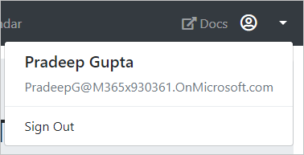

<!-- markdownlint-disable MD002 MD041 -->

In this exercise you will extend the application from the previous exercise to support authentication with Azure AD. This is required to obtain the necessary OAuth access token to call the Microsoft Graph API. In this step you will integrate the OWIN middleware and the [Microsoft Authentication Library](https://www.nuget.org/packages/Microsoft.Identity.Client/) library into the application.

1. Right-click the **graph-tutorial** project in Solution Explorer and select **Add > New Item...**. Choose **Web Configuration File**, name the file `PrivateSettings.config` and select **Add**. Replace its entire contents with the following code.

    ```xml
    <appSettings>
        <add key="ida:AppID" value="YOUR APP ID" />
        <add key="ida:AppSecret" value="YOUR APP PASSWORD" />
        <add key="ida:RedirectUri" value="https://localhost:PORT/" />
        <add key="ida:AppScopes" value="User.Read Calendars.Read" />
    </appSettings>
    ```

    Replace `YOUR_APP_ID_HERE` with the application ID from the Application Registration Portal, and replace `YOUR_APP_PASSWORD_HERE` with the client secret you generated. If your client secret contains any ampersands (`&`), be sure to replace them with `&amp;` in `PrivateSettings.config`. Also be sure to modify the `PORT` value for the `ida:RedirectUri` to match your application's URL.

    > [!IMPORTANT]
    > If you're using source control such as git, now would be a good time to exclude the `PrivateSettings.config` file from source control to avoid inadvertently leaking your app ID and password.

1. Update `Web.config` to load this new file. Replace the `<appSettings>` (line 7) with the following

    ```xml
    <appSettings file="PrivateSettings.config">
    ```

## Implement sign-in

Start by initializing the OWIN middleware to use Azure AD authentication for the app.

1. Right-click the **App_Start** folder in Solution Explorer and select **Add > Class...**. Name the file `Startup.Auth.cs` and select **Add**. Replace the entire contents with the following code.

    ```cs
    using Microsoft.Identity.Client;
    using Microsoft.IdentityModel.Protocols.OpenIdConnect;
    using Microsoft.IdentityModel.Tokens;
    using Microsoft.Owin.Security;
    using Microsoft.Owin.Security.Cookies;
    using Microsoft.Owin.Security.Notifications;
    using Microsoft.Owin.Security.OpenIdConnect;
    using Owin;
    using System.Configuration;
    using System.Threading.Tasks;
    using System.Web;

    namespace graph_tutorial
    {
        public partial class Startup
        {
            // Load configuration settings from PrivateSettings.config
            private static string appId = ConfigurationManager.AppSettings["ida:AppId"];
            private static string appSecret = ConfigurationManager.AppSettings["ida:AppSecret"];
            private static string redirectUri = ConfigurationManager.AppSettings["ida:RedirectUri"];
            private static string graphScopes = ConfigurationManager.AppSettings["ida:AppScopes"];

            public void ConfigureAuth(IAppBuilder app)
            {
                app.SetDefaultSignInAsAuthenticationType(CookieAuthenticationDefaults.AuthenticationType);

                app.UseCookieAuthentication(new CookieAuthenticationOptions());

                app.UseOpenIdConnectAuthentication(
                  new OpenIdConnectAuthenticationOptions
                  {
                      ClientId = appId,
                      Authority = "https://login.microsoftonline.com/common/v2.0",
                      Scope = $"openid email profile offline_access {graphScopes}",
                      RedirectUri = redirectUri,
                      PostLogoutRedirectUri = redirectUri,
                      TokenValidationParameters = new TokenValidationParameters
                      {
                          // For demo purposes only, see below
                          ValidateIssuer = false

                          // In a real multi-tenant app, you would add logic to determine whether the
                          // issuer was from an authorized tenant
                          //ValidateIssuer = true,
                          //IssuerValidator = (issuer, token, tvp) =>
                          //{
                          //  if (MyCustomTenantValidation(issuer))
                          //  {
                          //    return issuer;
                          //  }
                          //  else
                          //  {
                          //    throw new SecurityTokenInvalidIssuerException("Invalid issuer");
                          //  }
                          //}
                      },
                      Notifications = new OpenIdConnectAuthenticationNotifications
                      {
                          AuthenticationFailed = OnAuthenticationFailedAsync,
                          AuthorizationCodeReceived = OnAuthorizationCodeReceivedAsync
                      }
                  }
                );
            }

            private static Task OnAuthenticationFailedAsync(AuthenticationFailedNotification<OpenIdConnectMessage,
              OpenIdConnectAuthenticationOptions> notification)
            {
                notification.HandleResponse();
                string redirect = $"/Home/Error?message={notification.Exception.Message}";
                if (notification.ProtocolMessage != null && !string.IsNullOrEmpty(notification.ProtocolMessage.ErrorDescription))
                {
                    redirect += $"&debug={notification.ProtocolMessage.ErrorDescription}";
                }
                notification.Response.Redirect(redirect);
                return Task.FromResult(0);
            }

            private async Task OnAuthorizationCodeReceivedAsync(AuthorizationCodeReceivedNotification notification)
            {
                var idClient = ConfidentialClientApplicationBuilder.Create(appId)
                    .WithRedirectUri(redirectUri)
                    .WithClientSecret(appSecret)
                    .Build();

                string message;
                string debug;

                try
                {
                    string[] scopes = graphScopes.Split(' ');

                    var result = await idClient.AcquireTokenByAuthorizationCode(
                        scopes, notification.Code).ExecuteAsync();

                    message = "Access token retrieved.";
                    debug = result.AccessToken;
                }
                catch (MsalException ex)
                {
                    message = "AcquireTokenByAuthorizationCodeAsync threw an exception";
                    debug = ex.Message;
                }

                notification.HandleResponse();
                notification.Response.Redirect($"/Home/Error?message={message}&debug={debug}");
            }
        }
    }
    ```

    > [!NOTE]
    > This code configures the OWIN middleware with the values from `PrivateSettings.config` and defines two callback methods, `OnAuthenticationFailedAsync` and `OnAuthorizationCodeReceivedAsync`. These callback methods will be invoked when the sign-in process returns from Azure.

1. Now update the `Startup.cs` file to call the `ConfigureAuth` method. Replace the entire contents of `Startup.cs` with the following code.

    ```cs
    using Microsoft.Owin;
    using Owin;

    [assembly: OwinStartup(typeof(graph_tutorial.Startup))]

    namespace graph_tutorial
    {
        public partial class Startup
        {
            public void Configuration(IAppBuilder app)
            {
                ConfigureAuth(app);
            }
        }
    }
    ```

1. Add an `Error` action to the `HomeController` class to transform the `message` and `debug` query parameters into an `Alert` object. Open `Controllers/HomeController.cs` and add the following function.

    ```cs
    public ActionResult Error(string message, string debug)
    {
        Flash(message, debug);
        return RedirectToAction("Index");
    }
    ```

1. Add a controller to handle sign-in. Right-click the **Controllers** folder in Solution Explorer and select **Add > Controller...**. Choose **MVC 5 Controller - Empty** and select **Add**. Name the controller `AccountController` and select **Add**. Replace the entire contents of the file with the following code.

    ```cs
    using Microsoft.Owin.Security;
    using Microsoft.Owin.Security.Cookies;
    using Microsoft.Owin.Security.OpenIdConnect;
    using System.Security.Claims;
    using System.Web;
    using System.Web.Mvc;

    namespace graph_tutorial.Controllers
    {
        public class AccountController : Controller
        {
            public void SignIn()
            {
                if (!Request.IsAuthenticated)
                {
                    // Signal OWIN to send an authorization request to Azure
                    Request.GetOwinContext().Authentication.Challenge(
                        new AuthenticationProperties { RedirectUri = "/" },
                        OpenIdConnectAuthenticationDefaults.AuthenticationType);
                }
            }

            public ActionResult SignOut()
            {
                if (Request.IsAuthenticated)
                {
                    Request.GetOwinContext().Authentication.SignOut(
                        CookieAuthenticationDefaults.AuthenticationType);
                }

                return RedirectToAction("Index", "Home");
            }
        }
    }
    ```

    This defines a `SignIn` and `SignOut` action. The `SignIn` action checks if the request is already authenticated. If not, it invokes the OWIN middleware to authenticate the user. The `SignOut` action invokes the OWIN middleware to sign out.

1. Save your changes and start the project. Click the sign-in button and you should be redirected to `https://login.microsoftonline.com`. Login with your Microsoft account and consent to the requested permissions. The browser redirects to the app, showing the token.

### Get user details

Once the user is logged in, you can get their information from Microsoft Graph.

1. Right-click the **graph-tutorial** folder in Solution Explorer, and select **Add > New Folder**. Name the folder `Helpers`.

1. Right click this new folder and select **Add > Class...**. Name the file `GraphHelper.cs` and select **Add**. Replace the contents of this file with the following code.

    ```cs
    using Microsoft.Graph;
    using System.Net.Http.Headers;
    using System.Threading.Tasks;

    namespace graph_tutorial.Helpers
    {
        public static class GraphHelper
        {
            public static async Task<User> GetUserDetailsAsync(string accessToken)
            {
                var graphClient = new GraphServiceClient(
                    new DelegateAuthenticationProvider(
                        async (requestMessage) =>
                        {
                            requestMessage.Headers.Authorization =
                                new AuthenticationHeaderValue("Bearer", accessToken);
                        }));

                return await graphClient.Me.Request().GetAsync();
            }
        }
    }
    ```

    This implements the `GetUserDetails` function, which uses the Microsoft Graph SDK to call the `/me` endpoint and return the result.

1. Update the `OnAuthorizationCodeReceivedAsync` method in `App_Start/Startup.Auth.cs` to call this function. Add the following `using` statement to the top of the file.

    ```cs
    using graph_tutorial.Helpers;
    ```

1. Replace the existing `try` block in `OnAuthorizationCodeReceivedAsync` with the following code.

    ```cs
    try
    {
        string[] scopes = graphScopes.Split(' ');

        var result = await idClient.AcquireTokenByAuthorizationCode(
            scopes, notification.Code).ExecuteAsync();

        var userDetails = await GraphHelper.GetUserDetailsAsync(result.AccessToken);

        string email = string.IsNullOrEmpty(userDetails.Mail) ?
            userDetails.UserPrincipalName : userDetails.Mail;

        message = "User info retrieved.";
        debug = $"User: {userDetails.DisplayName}, Email: {email}";
    }
    ```

1. Save your changes and start the app, after sign-in you should see the user's name and email address instead of the access token.

## Storing the tokens

Now that you can get tokens, it's time to implement a way to store them in the app. Since this is a sample app, you will use the session to store the tokens. A real-world app would use a more reliable secure storage solution, like a database. In this section, you will:

- Implement a token store class to serialize and store the MSAL token cache and the user's details in the user session.
- Update the authentication code to use the token store class.
- Update the base controller class to expose the stored user details to all views in the application.

1. Right-click the **graph-tutorial** folder in Solution Explorer, and select **Add > New Folder**. Name the folder `TokenStorage`.

1. Right click this new folder and select **Add > Class...**. Name the file `SessionTokenStore.cs` and select **Add**. Replace the contents of this file with the following code.

    ```cs
    // Copyright (c) Microsoft Corporation. All rights reserved.
    // Licensed under the MIT license.

    using Microsoft.Identity.Client;
    using Newtonsoft.Json;
    using System.Security.Claims;
    using System.Threading;
    using System.Web;

    namespace graph_tutorial.TokenStorage
    {
        // Simple class to serialize into the session
        public class CachedUser
        {
            public string DisplayName { get; set; }
            public string Email { get; set; }
            public string Avatar { get; set; }
        }

        public class SessionTokenStore
        {
            private static readonly ReaderWriterLockSlim sessionLock = new ReaderWriterLockSlim(LockRecursionPolicy.NoRecursion);

            private HttpContext httpContext = null;
            private string tokenCacheKey = string.Empty;
            private string userCacheKey = string.Empty;

            public SessionTokenStore(ITokenCache tokenCache, HttpContext context, ClaimsPrincipal user)
            {
                httpContext = context;

                if (tokenCache != null)
                {
                    tokenCache.SetBeforeAccess(BeforeAccessNotification);
                    tokenCache.SetAfterAccess(AfterAccessNotification);
                }

                var userId = GetUsersUniqueId(user);
                tokenCacheKey = $"{userId}_TokenCache";
                userCacheKey = $"{userId}_UserCache";
            }

            public bool HasData()
            {
                return (httpContext.Session[tokenCacheKey] != null &&
                    ((byte[])httpContext.Session[tokenCacheKey]).Length > 0);
            }

            public void Clear()
            {
                sessionLock.EnterWriteLock();

                try
                {
                    httpContext.Session.Remove(tokenCacheKey);
                }
                finally
                {
                    sessionLock.ExitWriteLock();
                }
            }

            private void BeforeAccessNotification(TokenCacheNotificationArgs args)
            {
                sessionLock.EnterReadLock();

                try
                {
                    // Load the cache from the session
                    args.TokenCache.DeserializeMsalV3((byte[])httpContext.Session[tokenCacheKey]);
                }
                finally
                {
                    sessionLock.ExitReadLock();
                }
            }

            private void AfterAccessNotification(TokenCacheNotificationArgs args)
            {
                if (args.HasStateChanged)
                {
                    sessionLock.EnterWriteLock();

                    try
                    {
                        // Store the serialized cache in the session
                        httpContext.Session[tokenCacheKey] = args.TokenCache.SerializeMsalV3();
                    }
                    finally
                    {
                        sessionLock.ExitWriteLock();
                    }
                }
            }

            public void SaveUserDetails(CachedUser user)
            {

                sessionLock.EnterWriteLock();
                httpContext.Session[userCacheKey] = JsonConvert.SerializeObject(user);
                sessionLock.ExitWriteLock();
            }

            public CachedUser GetUserDetails()
            {
                sessionLock.EnterReadLock();
                var cachedUser = JsonConvert.DeserializeObject<CachedUser>((string)httpContext.Session[userCacheKey]);
                sessionLock.ExitReadLock();
                return cachedUser;
            }

            private string GetUsersUniqueId(ClaimsPrincipal user)
            {
                // Combine the user's object ID with their tenant ID

                if (user != null)
                {
                    var userObjectId = user.FindFirst("http://schemas.microsoft.com/identity/claims/objectidentifier").Value ??
                        user.FindFirst("oid").Value;

                    var userTenantId = user.FindFirst("http://schemas.microsoft.com/identity/claims/objectidentifier").Value ??
                        user.FindFirst("tid").Value;

                    if (!string.IsNullOrEmpty(userObjectId) && !string.IsNullOrEmpty(userTenantId))
                    {
                        return $"{userObjectId}.{userTenantId}";
                    }
                }

                return null;
            }
        }
    }
    ```

1. Add the following `using` statement to the top of the `App_Start/Startup.Auth.cs` file.

    ```cs
    using graph_tutorial.TokenStorage;
    ```

1. Replace the existing `OnAuthorizationCodeReceivedAsync` function with the following.

    ```cs
    private async Task OnAuthorizationCodeReceivedAsync(AuthorizationCodeReceivedNotification notification)
    {
        var idClient = ConfidentialClientApplicationBuilder.Create(appId)
            .WithRedirectUri(redirectUri)
            .WithClientSecret(appSecret)
            .Build();

        var signedInUser = new ClaimsPrincipal(notification.AuthenticationTicket.Identity);
        var tokenStore = new SessionTokenStore(idClient.UserTokenCache, HttpContext.Current, signedInUser);

        try
        {
            string[] scopes = graphScopes.Split(' ');

            var result = await idClient.AcquireTokenByAuthorizationCode(
                scopes, notification.Code).ExecuteAsync();

            var userDetails = await GraphHelper.GetUserDetailsAsync(result.AccessToken);

            var cachedUser = new CachedUser()
            {
                DisplayName = userDetails.DisplayName,
                Email = string.IsNullOrEmpty(userDetails.Mail) ?
                userDetails.UserPrincipalName : userDetails.Mail,
                Avatar = string.Empty
            };

            tokenStore.SaveUserDetails(cachedUser);
        }
        catch (MsalException ex)
        {
            string message = "AcquireTokenByAuthorizationCodeAsync threw an exception";
            notification.HandleResponse();
            notification.Response.Redirect($"/Home/Error?message={message}&debug={ex.Message}");
        }
        catch (Microsoft.Graph.ServiceException ex)
        {
            string message = "GetUserDetailsAsync threw an exception";
            notification.HandleResponse();
            notification.Response.Redirect($"/Home/Error?message={message}&debug={ex.Message}");
        }
    }
    ```

    > [!NOTE]
    > The changes in this new version of `OnAuthorizationCodeReceivedAsync` do the following:
    >
    > - The code now wraps the `ConfidentialClientApplication`'s default user token cache with the `SessionTokenStore` class. The MSAL library will handle the logic of storing the tokens and refreshing it when needed.
    > - The code now passes the user details obtained from Microsoft Graph to the `SessionTokenStore` object to store in the session.
    > - On success, the code no longer redirects, it just returns. This allows the OWIN middleware to complete the authentication process.

1. Update the `SignOut` action to clear the token store before signing out. Add the following `using` statement to the top of `Controllers/AccountController.cs`.

    ```cs
    using graph_tutorial.TokenStorage;
    ```

1. Replace the existing `SignOut` function with the following.

    ```cs
    public ActionResult SignOut()
    {
        if (Request.IsAuthenticated)
        {
            var tokenStore = new SessionTokenStore(null,
                System.Web.HttpContext.Current, ClaimsPrincipal.Current);

            tokenStore.Clear();

            Request.GetOwinContext().Authentication.SignOut(
                CookieAuthenticationDefaults.AuthenticationType);
        }

        return RedirectToAction("Index", "Home");
    }
    ```

1. Open `Controllers/BaseController.cs` and add the following `using` statements to the top of the file.

    ```cs
    using graph_tutorial.TokenStorage;
    using System.Security.Claims;
    using System.Web;
    using Microsoft.Owin.Security.Cookies;
    ```

1. Add the following function.

    ```cs
    protected override void OnActionExecuting(ActionExecutingContext filterContext)
    {
        if (Request.IsAuthenticated)
        {
            // Get the user's token cache
            var tokenStore = new SessionTokenStore(null,
                System.Web.HttpContext.Current, ClaimsPrincipal.Current);

            if (tokenStore.HasData())
            {
                // Add the user to the view bag
                ViewBag.User = tokenStore.GetUserDetails();
            }
            else
            {
                // The session has lost data. This happens often
                // when debugging. Log out so the user can log back in
                Request.GetOwinContext().Authentication.SignOut(CookieAuthenticationDefaults.AuthenticationType);
                filterContext.Result = RedirectToAction("Index", "Home");
            }
        }

        base.OnActionExecuting(filterContext);
    }
    ```

1. Start the server and go through the sign-in process. You should end up back on the home page, but the UI should change to indicate that you are signed-in.

    

1. Click the user avatar in the top right corner to access the **Sign Out** link. Clicking **Sign Out** resets the session and returns you to the home page.

    

## Refreshing tokens

At this point your application has an access token, which is sent in the `Authorization` header of API calls. This is the token that allows the app to access Microsoft Graph on the user's behalf.

However, this token is short-lived. The token expires an hour after it is issued. This is where the refresh token becomes useful. The refresh token allows the app to request a new access token without requiring the user to sign in again.

Because the app is using the MSAL library and serializing the `TokenCache` object, you do not have to implement any token refresh logic. The `ConfidentialClientApplication.AcquireTokenSilentAsync` method does all of the logic for you. It first checks the cached token, and if it is not expired, it returns it. If it is expired, it uses the cached refresh token to obtain a new one. You'll use this method in the following module.
