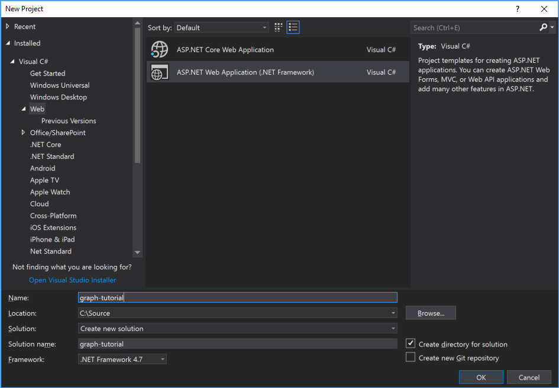
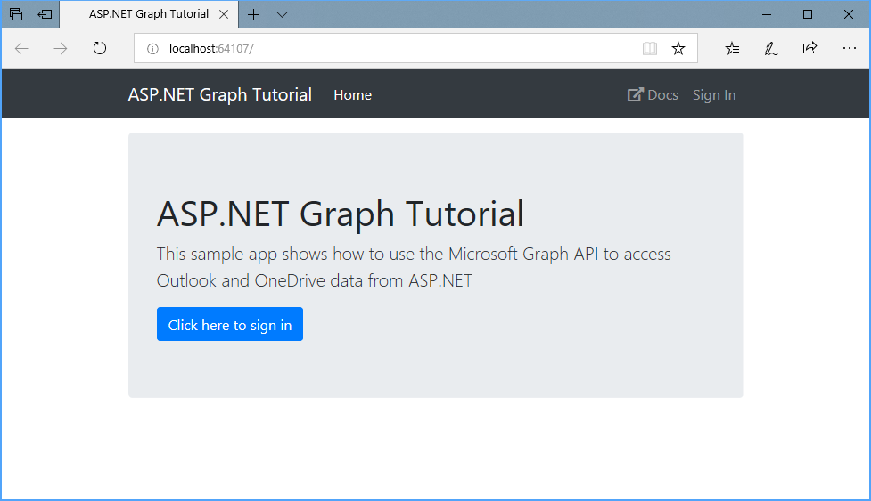

<!-- markdownlint-disable MD002 MD041 -->

Open Visual Studio, and select **File > New > Project**. In the **New Project** dialog, do the following:

1. Select **Templates > Visual C# > Web**.
1. Select **ASP.NET Web Application (.NET Framework)**.
1. Enter **graph-tutorial** for the Name of the project.



> [!NOTE]
> Ensure that you enter the exact same name for the Visual Studio Project that is specified in these lab instructions. The Visual Studio Project name becomes part of the namespace in the code. The code inside these instructions depends on the namespace matching the Visual Studio Project name specified in these instructions. If you use a different project name the code will not compile unless you adjust all the namespaces to match the Visual Studio Project name you enter when you create the project.

Select **OK**. In the **New ASP.NET Web Application Project** dialog, select **MVC** (under **ASP.NET 4.7 Templates**) and select **OK**.

Press **F5** or select **Debug > Start Debugging**. If everything is working, your default browser should open and display a default ASP.NET page.

Before moving on, update the `bootstrap` NuGet package, and install some additional NuGet packages that you will use later.

- [Microsoft.Owin.Host.SystemWeb](https://www.nuget.org/packages/Microsoft.Owin.Host.SystemWeb/) to enable the [OWIN](http://owin.org/) interfaces in the ASP.NET application.
- [Microsoft.Owin.Security.OpenIdConnect](https://www.nuget.org/packages/Microsoft.Owin.Security.OpenIdConnect/) for doing OpenID Connect authentication with Azure.
- [Microsoft.Owin.Security.Cookies](https://www.nuget.org/packages/Microsoft.Owin.Security.Cookies/) to enable cookie-based authentication.
- [Microsoft.Identity.Client](https://www.nuget.org/packages/Microsoft.Identity.Client/) for requesting and managing access tokens.
- [Microsoft.Graph](https://www.nuget.org/packages/Microsoft.Graph/) for making calls to the Microsoft Graph.

Select **Tools > NuGet Package Manager > Package Manager Console**. In the Package Manager Console, enter the following commands.

```Powershell
Update-Package bootstrap
Install-Package Microsoft.Owin.Host.SystemWeb
Install-Package Microsoft.Owin.Security.OpenIdConnect
Install-Package Microsoft.Owin.Security.Cookies
Install-Package Microsoft.Identity.Client -Version 2.1.0-preview
Install-Package Microsoft.Graph -Version 1.11.0
```

Create a basic OWIN startup class. Right-click the `graph-tutorial` folder in Solution Explorer and choose **Add > New Item**. Choose the **OWIN Startup Class** template, name the file `Startup.cs`, and choose **Add**.

## Design the app

Start by creating a simple model for an error message. You'll use this model to flash error messages in the app's views.

Right-click the **Models** folder in Solution Explorer and choose **Add > Class...**. Name the class `Alert` and choose **Add**. Add the following code in `Alert.cs`.

```cs
namespace graph_tutorial.Models
{
    public class Alert
    {
        public const string AlertKey = "TempDataAlerts";
        public string Message { get; set; }
        public string Debug { get; set; }
    }
}
```

Now update the global layout of the app. Open the `./Views/Shared/_Layout.cshtml` file, and replace its entire contents with the following code.

```html
@{
    var alerts = TempData.ContainsKey(graph_tutorial.Models.Alert.AlertKey) ?
        (List<graph_tutorial.Models.Alert>)TempData[graph_tutorial.Models.Alert.AlertKey] :
        new List<graph_tutorial.Models.Alert>();
}

<!DOCTYPE html>
<html>
<head>
    <meta charset="utf-8" />
    <meta name="viewport" content="width=device-width, initial-scale=1.0">
    <title>ASP.NET Graph Tutorial</title>
    @Styles.Render("~/Content/css")
    @Scripts.Render("~/bundles/modernizr")

    <link rel="stylesheet" href="https://use.fontawesome.com/releases/v5.1.0/css/all.css"
          integrity="sha384-lKuwvrZot6UHsBSfcMvOkWwlCMgc0TaWr+30HWe3a4ltaBwTZhyTEggF5tJv8tbt"
          crossorigin="anonymous">
</head>

<body>
    <nav class="navbar navbar-expand-md navbar-dark fixed-top bg-dark">
        <div class="container">
            @Html.ActionLink("ASP.NET Graph Tutorial", "Index", "Home", new { area = "" }, new { @class = "navbar-brand" })
            <button class="navbar-toggler" type="button" data-toggle="collapse" data-target="#navbarCollapse"
                    aria-controls="navbarCollapse" aria-expanded="false" aria-label="Toggle navigation">
                <span class="navbar-toggler-icon"></span>
            </button>
            <div class="collapse navbar-collapse" id="navbarCollapse">
                <ul class="navbar-nav mr-auto">
                    <li class="nav-item">
                        @Html.ActionLink("Home", "Index", "Home", new { area = "" },
                            new { @class = ViewBag.Current == "Home" ? "nav-link active" : "nav-link" })
                    </li>
                    @if (Request.IsAuthenticated)
                    {
                        <li class="nav-item" data-turbolinks="false">
                            @Html.ActionLink("Calendar", "Index", "Calendar", new { area = "" },
                                new { @class = ViewBag.Current == "Calendar" ? "nav-link active" : "nav-link" })
                        </li>
                    }
                </ul>
                <ul class="navbar-nav justify-content-end">
                    <li class="nav-item">
                        <a class="nav-link" href="https://developer.microsoft.com/graph/docs/concepts/overview" target="_blank">
                            <i class="fas fa-external-link-alt mr-1"></i>Docs
                        </a>
                    </li>
                    @if (Request.IsAuthenticated)
                    {
                        <li class="nav-item dropdown">
                            <a class="nav-link dropdown-toggle" data-toggle="dropdown" href="#" role="button" aria-haspopup="true" aria-expanded="false">
                                @if (!string.IsNullOrEmpty(ViewBag.User.Avatar))
                                {
                                    
                                }
                                else
                                {
                                    <i class="far fa-user-circle fa-lg rounded-circle align-self-center mr-2" style="width: 32px;"></i>
                                }
                            </a>
                            <div class="dropdown-menu dropdown-menu-right">
                                <h5 class="dropdown-item-text mb-0">@ViewBag.User.DisplayName</h5>
                                <p class="dropdown-item-text text-muted mb-0">@ViewBag.User.Email</p>
                                <div class="dropdown-divider"></div>
                                @Html.ActionLink("Sign Out", "SignOut", "Account", new { area = "" }, new { @class = "dropdown-item" })
                            </div>
                        </li>
                    }
                    else
                    {
                        <li class="nav-item">
                            @Html.ActionLink("Sign In", "SignIn", "Account", new { area = "" }, new { @class = "nav-link" })
                        </li>
                    }
                </ul>
            </div>
        </div>
    </nav>
    <main role="main" class="container">
        @foreach (var alert in alerts)
        {
            <div class="alert alert-danger" role="alert">
                <p class="mb-3">@alert.Message</p>
                @if (!string.IsNullOrEmpty(alert.Debug))
                {
                    <pre class="alert-pre border bg-light p-2"><code>@alert.Debug</code></pre>
                }
            </div>
        }

        @RenderBody()
    </main>
    @Scripts.Render("~/bundles/jquery")
    @Scripts.Render("~/bundles/bootstrap")
    @RenderSection("scripts", required: false)
</body>
</html>
```

This code adds [Bootstrap](http://getbootstrap.com/) for simple styling, and [Font Awesome](https://fontawesome.com/) for some simple icons. It also defines a global layout with a nav bar, and uses the `Alert` class to display any alerts.

Now open `Content/Site.css` and replace its entire contents with the following code.

```css
body {
  padding-top: 4.5rem;
}

.alert-pre {
  word-wrap: break-word;
  word-break: break-all;
  white-space: pre-wrap;
}
```

Now update the default page. Open the `Views/Home/index.cshtml` file and replace its contents with the following.

```html
@{
    ViewBag.Current = "Home";
}

<div class="jumbotron">
    <h1>ASP.NET Graph Tutorial</h1>
    <p class="lead">This sample app shows how to use the Microsoft Graph API to access Outlook and OneDrive data from ASP.NET</p>
    @if (Request.IsAuthenticated)
    {
        <h4>Welcome @ViewBag.User.DisplayName!</h4>
        <p>Use the navigation bar at the top of the page to get started.</p>
    }
    else
    {
        @Html.ActionLink("Click here to sign in", "SignIn", "Account", new { area = "" }, new { @class = "btn btn-primary btn-large" })
    }
</div>
```

Now add a helper function to create an `Alert` and pass it to the view. In order to make it easily available to any controller we create, define a base controller class.

Right-click the **Controllers** folder in Solution Explorer and choose **Add > Controller...**. Choose **MVC 5 Controller - Empty** and choose **Add**. Name the controller `BaseController` and choose **Add**. Replace the contents of `BaseController.cs` with the following code.

```cs
using graph_tutorial.Models;
using System.Collections.Generic;
using System.Web.Mvc;

namespace graph_tutorial.Controllers
{
    public abstract class BaseController : Controller
    {
        protected void Flash(string message, string debug=null)
        {
            var alerts = TempData.ContainsKey(Alert.AlertKey) ?
                (List<Alert>)TempData[Alert.AlertKey] :
                new List<Alert>();

            alerts.Add(new Alert
            {
                Message = message,
                Debug = debug
            });

            TempData[Alert.AlertKey] = alerts;
        }
    }
}
```

Any controller can inherit from this base controller class to gain access to the `Flash` function. Update the `HomeController` class to inherit from `BaseController`. Open `Controllers/HomeController.cs` and change the `public class HomeController : Controller` line to:

```cs
public class HomeController : BaseController
```

Save all of your changes and restart the server. Now, the app should look very different.

